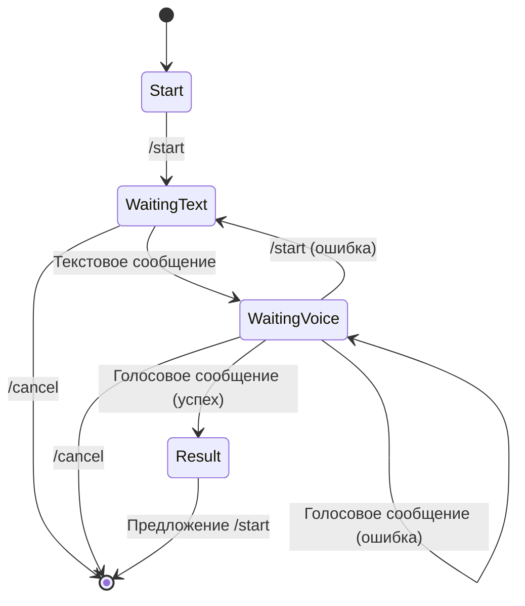

speech-analyst-bot/
├── .env                    # Файл окружения (токены)
├── bot.py                  # Основной скрипт бота
├── audio_processor.py      # Обработка аудио
├── text_analyzer.py        # Анализ текста
├── report_generator.py     # Генерация отчетов
├── config.py               # Конфигурация
├── requirements.txt        # Зависимости
└── README.md               # Инструкции
